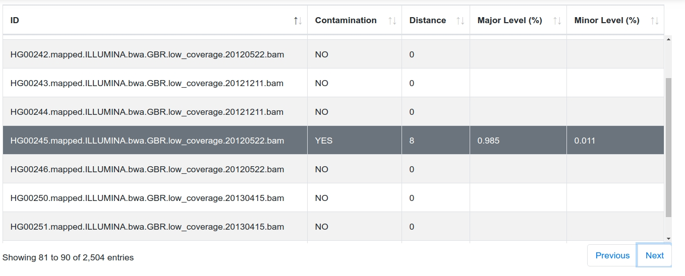
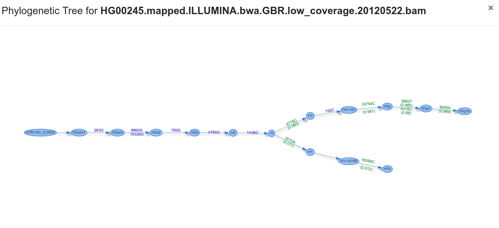
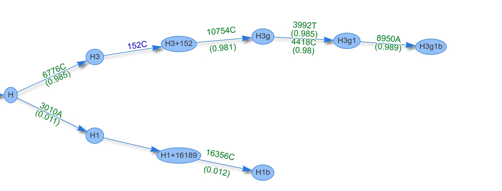

## Interpret Results

Haplocheck reports the contamination status for each mitochondrial input sample and creates (a) a graphical report ([Example Report](sample/report.html)) and (b) a textual description ([Example Contamination File](sample/contamination.txt)).

### Graphical Report

The graphical report includes the most important information from the textual result file (see Textual Report File below). The table can be filtered, sorted and searched by specific samples. Additionally, for each sample a phylogenetic tree is generated using the graph information from Phylotree 17.

#### Phylogenetic Tree
The tree starts at the root node (rCRS) and shows homoplasmic (blue) / heteroplasmic (green) positions for each transition until the final haplogroup (as assigned by Haplogrep) has been reached. The two branches represent the final haplogroups of the major and minor profile. In our case the two profiles are **H1b** and **H3g1b**.

### Textual Report File

A text file including all required information is created by haplocheck. The following columns are included in the tab-delimited file (The header corresponds to the column name)

#### Sample

This column includes the sample identifier. (*before v1.0.7: SampleID*)

#### Contamination Status
Haplocheck works by splitting each input sample into two profiles, the so called **major** and **minor** component. Homoplasmies are always added to both profiles, heteroplasmies are split and added to the correct profile. Depending on several internal parameters (e.g. distance between haplogroups, number of heteroplasmies), haplocheck assigns a contamination status to each sample. This column can either be **YES** or **NO**. (*before v1.0.7: Contamination*)

#### Overall Homoplasmies
Total number of included homoplasmies in the sample. (*before v1.0.7: SampleHomoplasmies*)

#### Overall Heteroplasmies
Total number of included heteroplasmies in the sample. (*before v1.0.7: SampleHeteroplasmies*)

#### Sample Coverage
The columns defines the mean coverage for the sample.  (*before v1.0.7: SampleMeanCoverage*)

#### Major Haplogroup
The major haplogroup is calculated by using [Haplogrep](http://haplogrep.uibk.ac.at/). The input profile includes all homoplasmies and the **major** component of each heteroplasmy.  (*before v1.0.7: HgMajor*)

#### Major Haplogroup Quality

This columns includes the haplogroup quality (provided by Haplogrep). Click [here](http://haplogrep.uibk.ac.at/blog/explaining-the-formula/) for details how the metric (so called *Kulczynski* measure) is calculated.  (*before v1.0.7: HgQualityMajor*)

#### Minor Haplogroup

The minor haplogroup is calculated by using Haplogrep. The input profile includes all homoplasmies and the **minor** component of each heteroplasmy.  (*before v1.0.7: HgMinor*)

#### Minor Haplogroup Quality  

This columns includes the haplogroup quality score (provided by Haplogrep). Click [here](http://haplogrep.uibk.ac.at/blog/explaining-the-formula/) for details how the metric (so called *Kulczynski* measure) is calculated. (*before v1.0.7: HgQualityMinor*)

#### Major Homoplasmies Count

Number of homoplasmies included in the **major** haplogroup. Please keep in mind that Haplogrep assigns the best haplogroup hit by traversing through the graph. Therefore not always all homoplasmies or heteroplasmies (as defined in the input profile) are required for the best hit.  (*before v1.0.7: HomoplasmiesMajor*)

#### Minor Homoplasmies Count

Number of homoplasmies included in the **minor** haplgroup.  (*before v1.0.7: HomoplasmiesMinor*)

#### Major Heteroplasmies Count

Number of heteroplasmies included in the **major** haplgroup.  (*before v1.0.7: HeteroplasmiesMajor*)

#### Minor Heteroplasmies Count

Number of heteroplasmies included in the **minor** haplgroup.  (*before v1.0.7: HeteroplasmiesMinor*)

#### Major Heteroplasmy Level

The major heteroplasmy level is calculated by averaging the level of each heteroplasmy (major components only). Additionally, only heteroplasmies from the common ancestor (so in our sample node **H**) are added to the level. The figure below shows the phylogenetic graph of sample HG00245. **H** is the common ancestor for both profiles, therefore only the heteroplasmies `6776C (0.985)`, `10754C (0.981)`, `3992T (0.985)`, `4418C (0.98)` and `8950A (0.989)` are used for the level calculation. By averaging all levels, a final major level of `0.984` is assigned. (*before v1.0.7: MeanHetLevelMajor*)

#### Minor Heteroplasmy Level

The minor heteroplasmy level is calculated by averaging the level of the minor component of each heteroplasmy. The sample HG00245 includes two minor components (`3010A (0.011)`, `16356C (0.012)`) to calculate the final heteroplasmy level of `0.011`.  (*before v1.0.7: MeanHetLevelMinor*)

#### Distance

This column defines the distance between the haplogroups of the major and minor profile using the graph structure of Phylotree 17. In the sample above, the distance would be `8` (Nodes between *H1b* and *H3g1b*). (*before v1.0.7: HG_Distance*)

#### Clusters

All heteroplasmies are clustered using the *Jenks natural breaks classification* method. This information is provided to the user to see the identified clusters by haplocheck.
