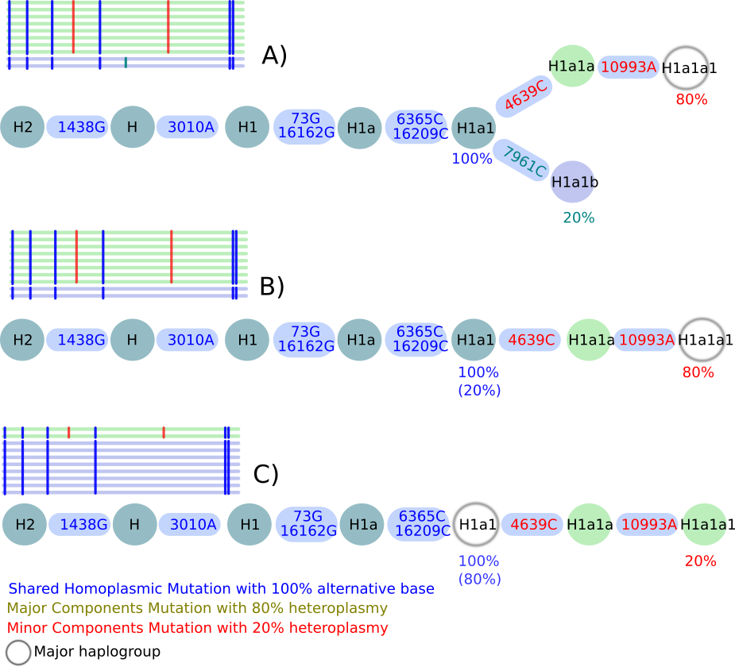

## Contamination Method

Haplocheck works by detecting two different components (or mitochondrial haplotypes) within one sample. Each heteroplasmic position is split into two components and added to a major and minor profile. Additionally, homoplasmic positions are added to both profiles. Each profile is then classified into a haplogroup. Since Haplogrep detects two components, we always output the contamination level of the minor and major component. 

When analysing the output, three different scenarios are possible (see Figure): 

### Scenario A

In this scenario haplocheck is able to identify a major and minor haplotype: The homoplasmic mutations (*marked in blue*) are present in both haplotypes and defining haplogroup **H1a1**. Three additional heteroplasmic positions are included in the sample. Haplocheck detects the **minor haplogroup H1a1b** including 7961C with 20% (i.e. included in 20 % of the reads) and the **major haplogroup H1a1a1** including 4639C + 10993A with 80 % (i.e. included in 80 % of the reads).

### Scenario B 

This scenario describes a mixture of two haplotypes within a single lineage but of different lineage depths. Again, the homoplasmic positions define the haplogroup H1a1. Two additional heteroplasmies 4639C + 10993A have been detected with 80 % which define the **major haplogroup H1a1a1**. No minor haplotype has been detected using the available heteroplasmic mutations. Therefore, the final minor haplotype is included in **H1a1**.   
 
### Scenario C

This scenario describes again a mixture of two haplotypes within a single lineage but of different lineage depths. Again, the homoplasmic positions define the haplogroup H1a1. Two additional heteroplasmies 4639C + 10993A have been detected with 20 % which define the **minor haplogroup H1a1a1**. No major haplotype can be detected using available heteroplasmic mutations. Therefore, the final major haplotype is included in **H1a1**.
 
 
